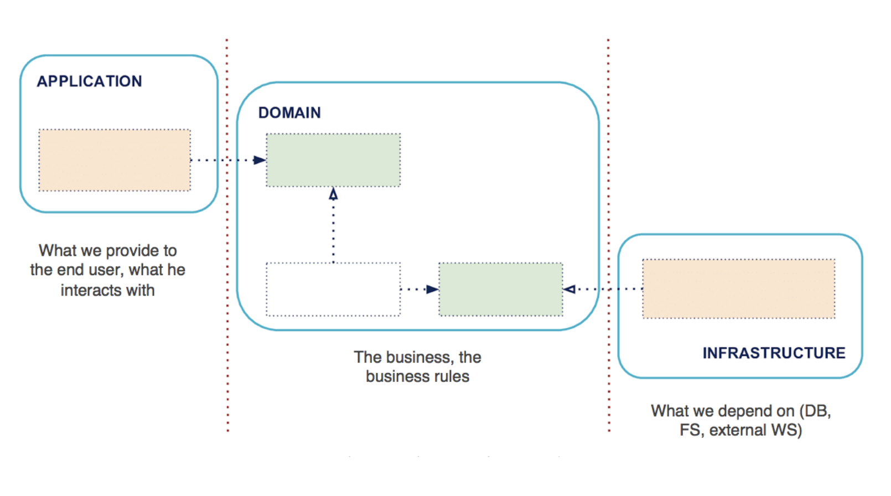

# Quarkus Domain Driven Design Boilerplate 
A sample project following Domain Driven Design based on Quarkus Framework.

## Table of Contents  
* [Introduction](#introduction)  
* [Prerequisites](#prerequisites)  
* [Features](#features)  
* [Highlights](#highlights)  
    - [Groovy Spock Test Framework](#groovy-spock-test-framework)  
    - [Panache](#panache)  
    - [Flyway](#flyway)  
* [Running the application in dev mode](#running-the-application-in-dev-mode)  
* [Packaging and running the application](#packaging-and-running-the-application)  
* [Creating a native executable](#creating-a-native-executable)  

  
## Introduction
 
The project is structured with Gradle in a multi-module way to split up the code base into smaller modules that has their own dependencies. Hence, we keep the context of modules isolated in terms of dependencies.  

It has three sub-modules;
* `domain` -> business logic without any dependency, entities, services and repository interfaces etc.
* `application` -> controller interfaces, application messages and validators, converters etc.
* `infrastructure` -> 3rd party dependencies, framework integrations, controller and repository implementations etc. 
 

 
It provides a CRUD sample which has the following operations; `list`, `create`, `update` and `delete`. 

You can inspect the postman collection in the root folder!

We hope this boilerplate can help the developers to focus on their business part. 

## Prerequisites
 * JDK11
 * GraalVM
 * Docker

## Features  
 * Gradle (multi-module)
 * Quarkus
 * RestEASY
 * Hibernate ORM with Panache
 * Flyway for db migration
 * PostgreSQL
 * Groovy Spock Framework for testing
 
If you want to learn more about Quarkus, please visit its website: https://quarkus.io/

## Highlights

### Groovy Spock Test Framework
Spock Framework has many great features that makes testing more fun! Also, it provides a great developer experience when it comes to Data Driven Testing.

You can check out the links below; 

[Groovy Spock All in One (Official Doc)](http://spockframework.org/spock/docs/1.1-rc-1/all_in_one.html)

[Testing with Groovy Spock by Yeliz from our team (Turkish Article)](https://medium.com/dolap-tech/spock-ve-groovy-ile-test-yazmak-hakk%C4%B1nda-586023acb095)

### Panache
We used Panache's `repository pattern` to avoid to include Panache dependency to `domain` module. Using the `active record pattern` requires adding the `Panache` dependency to the domain module which is an anti-pattern for our case. 

You can check out the link below;

[Quarkus Hibernate ORM with Panache](https://quarkus.io/guides/hibernate-orm-panache)

### Flyway
Easy to version and handle db migration scripts.

You can check out the link below;

[Flyway with Quarkus](https://quarkus.io/guides/flyway)

## Running the application in dev mode

You can run `Postgres` in your local using our docker-compose.yml file in the root folder. See `env/local-database.env` file for an additional config.
```shell script
docker-compose up
```

You can run your application in dev mode that enables live coding using:
```shell script
./gradlew quarkusDev
```

## Packaging and running the application

The application can be packaged using:
```shell script
./gradlew build
```
It produces the `quarkus-ddd-1.0.0.jar` file in the `/build` directory.
Be aware that it’s not an _über-jar_ as the dependencies are copied into the `build/lib` directory.

If you want to build an _über-jar_, execute the following command:
```shell script
./gradlew build -Dquarkus.package.type=uber-jar
```

The application is now runnable using `java -jar build/quarkus-ddd-1.0.0.jar`.

## Creating a native executable

You can create a native executable using: 
```shell script
./gradlew build -Dquarkus.package.type=native
```

Or, if you don't have GraalVM installed, you can run the native executable build in a container using: 
```shell script
./gradlew build -Dquarkus.package.type=native -Dquarkus.native.container-build=true
```

You can then execute your native executable with: `./build/quarkus-ddd-1.0.0`

If you want to learn more about building native executables, please consult https://quarkus.io/guides/gradle-tooling.
